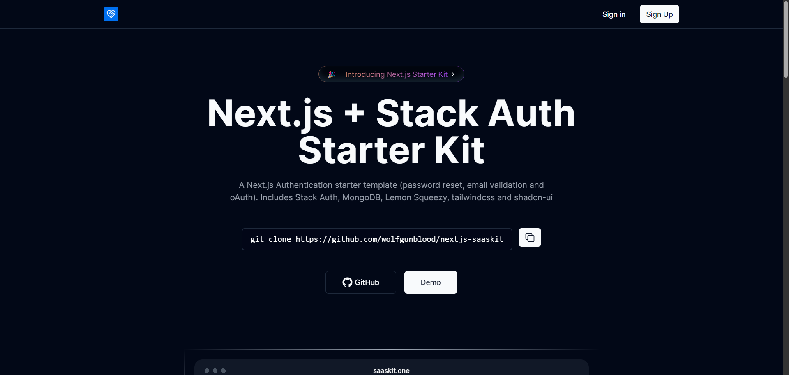

<h1 align="center">Next.js + Stack Auth Starter Template</h1>
<!-- 

 -->

## Motivation

Implementing authentication in Next.js, especially Email+Password authentication and Oauth, can be challenging. 
No more hassle with user management. Stack is the most developer-friendly way to manage your users, and it's 100% open-source.

### Screenshot

## Stack Auth

- Open-source User Auth & Management
- Integrate in minutes with no bullshit. For front- and backend.

## Key Features

- **Stack Authentication:** 💼 Support for Credential and OAuth(google,github) authentication.
- **Authorization:** 🔒 Easily manage public and protected routes within the `app directory`.
- **Email Verification:** 📧 Verify user identities through email.
- **Password Reset:** 🔑 Streamline password resets by sending email password reset links.
- **Lemonsqueezy Payment:** 💳 Setup user subscriptions seamlessly with stripe.
- **MongoDB Database:** 🛢️ Utilize a MongoDB database set up.

## Tech Stack

- [Next.js](https://nextjs.org)
- [Stack Auth](https://stack-auth.com/)
- [Tailwind CSS](https://tailwindcss.com)
- [Shadcn UI](https://ui.shadcn.com/)
- [React Hook Form](https://www.react-hook-form.com/)

## Get Started

1. Clone this repository to your local machine.
2. Copy `.env.loc` to `.env.local` and fill in the Stack Auth credential.
3. Copy `.env.example` to `.env` and fill in the required environment variables.
4. Run `pnpm install` to install dependencies.
8. Execute `pnpm dev` to start the development server and enjoy!

## Roadmap

- [] Lemonsqueezy Integration

## Contributing

To contribute, fork the repository and create a feature branch. Test your changes, and if possible, open an issue for discussion before submitting a pull request. Follow project guidelines, and welcome feedback to ensure a smooth integration of your contributions. Your pull requests are warmly welcome.